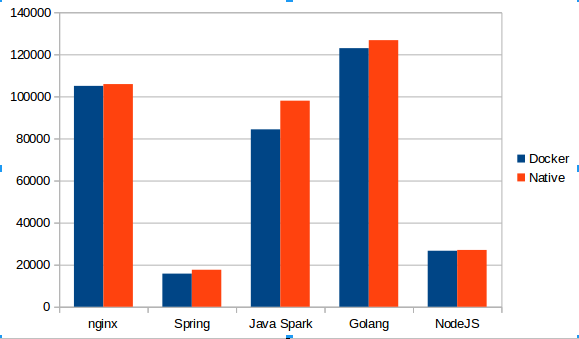

# HTTP 'Hello World' Benchmark
Mini bechmark, comparing the performance HTTP 'hello world' on different stacks:

* NGINX 1.11.5
* Java Spring-Boot 1.4.2, Oracle JDK 8
* Golang 1.7
* NodeJS 7.2

# Results

| Framework                | Requests per second |
|--------------------------|---------------------|
| nginx                    | 25861               |
| Spring-Boot (first run)  |  6041               |
| Spring-Boot (second run) | 10705               |
| Golang                   | 60662               |
| NodeJS                   | 20812               |

# Test setup
* Ubuntu 16.04.
* i7-6600U CPU @ 2.60GHz (2 cores, with hyper threadding)
* All Servers are running in a docker container (v1.12.3)
* Tested with [wrk](https://github.com/wg/wrk) (v4.0.0): 4 threads, 20 connections, 20 seconds

